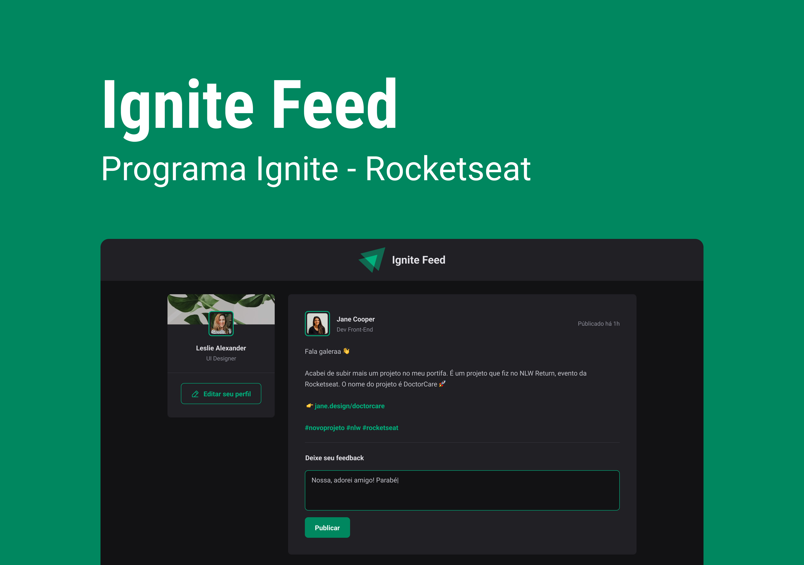

<h1 align="center">Projeto Fórum Ignite</h1>

Sistema de fórum para troca de informações e retiradas de dúvidas da comunidade dev.  

  <a href="#-tecnologias">Tecnologias</a>&nbsp;&nbsp;&nbsp;|&nbsp;&nbsp;&nbsp;
  <a href="#-projeto">Projeto</a>&nbsp;&nbsp;&nbsp;|&nbsp;&nbsp;&nbsp;
  <a href="#-layout">Layout</a>&nbsp;&nbsp;&nbsp;|&nbsp;&nbsp;&nbsp;
  <a href="#memo-licença">Licença</a>

  

 

  

## 🚀 Tecnologias

Esse projeto foi desenvolvido com as seguintes tecnologias:

- React
- Typescript
- Date-FNS
- Phosphor-React
 
## 💻 Projeto

Este fórum tem por finalidade testar habilidades com react sobre os Hooks de estados, e construir tipagens para os componentes estilizados.

## 🔖 Layout

Você pode visualizar o layout do projeto através [DESSE LINK](https://www.figma.com/file/mcW6c3ZaonkAOUv91g7Edx/Ignite-Feed-(Community)?node-id=26%3A12&t=4V9IkuA6NxSAcGaV-1). É necessário ter conta no [Figma](https://figma.com) para acessá-lo.

---
## :memo: Licença

Esse projeto está sob a licença MIT.

